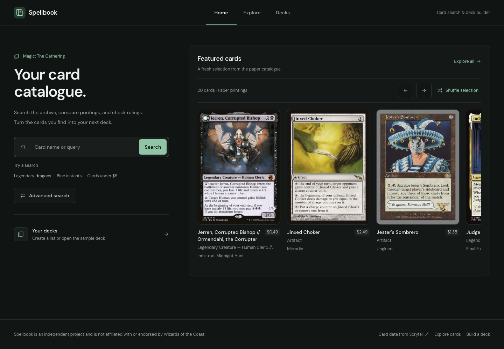

# Spellbook

A Magic: The Gathering card research and deck-building app built with **Next.js,
React, TypeScript, and Tailwind CSS**. Search the Scryfall archive, compare
printings and rulings, and build decks that survive browser reloads.

**No account, API key, or database setup is needed to try the application.**



[Architecture and tradeoffs](docs/architecture.md) ·
[Testing](docs/testing.md) · [Deployment](docs/deployment.md) ·
[Contributing](CONTRIBUTING.md)

More screenshots: [filtered Explore](docs/screenshots/explore.png) ·
[populated deck workspace](docs/screenshots/deck.png) ·
[mobile Explore](docs/screenshots/mobile-explore.png) ·
[mobile homepage](docs/screenshots/mobile-home.png)

## Try the core workflow

1. Open **Decks → Try a sample deck** to create an editable casual red-blue deck.
2. Change a quantity and inspect the mana curve, card types, and deck checks.
3. Select **Search cards**, choose a color or card type in Explore, and add a
   result to the deck. Filters apply automatically and are encoded in the URL.
4. Reload the deck page to verify persistence. Export JSON for a backup or a text
   list for another deck tool.
5. Open a card to compare Oracle text, legalities, available printings, and rulings.

The sample is a small teaching deck, not a tournament list. Its stored card
snapshots are dated; prices are omitted to avoid presenting old prices as current.

## Run locally

Install **Node.js 24** and npm, then open a terminal in this repository.
If you already use nvm, `nvm use` selects the version in `.nvmrc`.

```bash
npm ci
npm run dev
```

Open [localhost:3000](http://localhost:3000). No `.env.local` is needed.
Live search, card images, and details require access to Scryfall. The build also
downloads Google fonts through `next/font`; pages serve those fonts locally.

To run the production version:

```bash
npm run build
npm start
```

## What it demonstrates

| Engineering concern | Implementation |
| --- | --- |
| Shareable application state | Validated URL parameters generate composable Scryfall filters; inputs apply on selection or after a typing pause. |
| External service integration | Typed card normalization, request cancellation and timeouts, pagination, cached server lookups, and partial failures for supplemental details. |
| Domain modeling | Deck operations, format checks, statistics, and import/export are separate from React components. |
| Reliable persistence | Versioned browser storage, cross-tab notifications, validation of imports, and protection against overwriting unreadable data. |
| Accessible interaction | Keyboard autocomplete, visible focus, labeled inputs, responsive filters, status messages, and reduced-motion support. |
| Verification | Vitest domain tests, coverage thresholds, production-browser workflow tests, and axe accessibility checks in CI. |

## Features

- A homepage with a 20-card horizontal rail and quick searches.
- An Explore workspace with colors, mana value, types, rarity, formats, rules
  text, artist, set, price, and release-date filters.
- Gallery, detail, and compact views; sorting and explanations of search syntax.
- Card pages with double-faced card support, alternate printings, rulings,
  legality, and marketplace links.
- Multiple decks with rename, format selection, mainboard/sideboard/commander
  zones, quantity edits, removal, and confirmed deletion.
- JSON import and JSON/text export. Arbitrary text-list import is not implemented.
- A sample deck that can be opened and edited without an initial API request.
- Loading, empty, retry, missing-card, and storage-recovery states.

## Verify changes

Install the browser once:

```bash
npx playwright install chromium
```

Then run the complete local check:

```bash
npm run verify
```

| Command | Purpose |
| --- | --- |
| `npm run check` | ESLint, route type generation, TypeScript, and unit tests |
| `npm run test:coverage` | Domain coverage report and enforced thresholds |
| `npm run build` | Production compilation and static-route generation |
| `npm run test:e2e` | Desktop and mobile Chromium tests against the built app |
| `npm run test:e2e:ui` | Interactive browser test runner; build first |
| `npm run icons` | Regenerate the multi-size favicon and Apple touch icon from `app/icon.svg` |

Browser tests launch their own production server on port **3217** and use
isolated browser profiles. Search and autocomplete responses are mocked at the
network boundary for repeatability. These tests do not validate Scryfall uptime
or replace a live smoke test. Reports are retained as GitHub Actions artifacts.

## Project map

```text
app/                  Routes, metadata, loading/error boundaries, autocomplete API
components/           Search, card research, and deck interfaces
lib/                  Card filters, API adapters, deck operations and persistence
types/                Card, deck, account, and upstream API types
tests/                Unit tests and representative API fixtures
e2e/                  Production-browser workflow and accessibility tests
database/schema.sql   Reference PostgreSQL model (not an applied migration)
docs/                 Architecture, test scope, deployment, and backend roadmap
.github/              CI, dependency updates, issue and pull-request templates
```

## Scope and limitations

Decks are stored **in the current browser and origin**. They do not sync between
devices, localhost, preview deployments, and the production domain. Export JSON
before clearing site data. Concurrent-tab checks reduce accidental overwrites
but localStorage is not a transactional database.

Format checks are deck-building guidance, not a complete tournament rules engine.
Card snapshots can become stale after format changes. Random discovery samples
a result page and shuffles it; it is not an independent uniform draw of every card
in the archive. A cached pool makes repeat homepage draws responsive.

The database schema and repository contracts are **design groundwork only**.
There is no deployed authentication service, database, account sync, or AWS/Azure
integration. See [the backend milestone](docs/backend-readiness.md) for the
implementation and authorization tests required to add them.

## Deploy

Host the source on GitHub and deploy the app to a Next.js-capable host.
The recommended quick path is **Vercel**, using the repository integration,
`npm ci`, `npm run build`, and Node.js 24. See the
[deployment walkthrough](docs/deployment.md), including how to add a public demo
link and verify it from a signed-out browser. GitHub Pages cannot run this app's
server-rendered routes or autocomplete API.

## Data and acknowledgments

Card data and artwork come from [Scryfall](https://scryfall.com).
Spellbook is independent and is not affiliated with or endorsed by Wizards of
the Coast. Magic: The Gathering and related marks belong to their owners.
Card artwork and third-party data are not original project assets.

The repository does not currently grant an open-source license. Dependency
licenses remain with their respective authors; choose an explicit license for
the original application code before inviting reuse.
