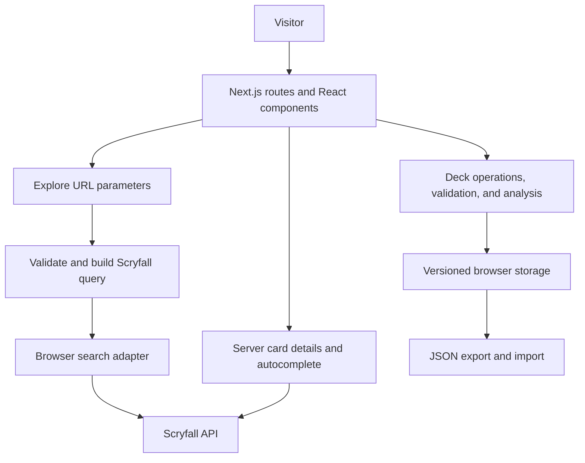

# Architecture and engineering decisions

Spellbook combines a card research interface with a browser-local deck editor.
The first release is designed to be immediately usable, reproducible from a
clean clone, and small enough to understand without separate services.

## Separate domain behavior from rendering

`lib/deck-operations.ts`, `lib/deck-analysis.ts`, and
`lib/deck-serialization.ts` contain operations tested without mounting React.
Components collect input and render their results. Rules changes can be tested
independently of layout changes.

Entries use an Oracle identity plus a zone, so alternate printings of the same
card share a quantity in that zone. Each entry stores a selected printing snapshot
for display. This suits a deck builder, not a collection tracker requiring
independent ownership counts for every printing.

## Use the URL as the applied search state

The Explore route validates search parameters before translating them into
Scryfall syntax. Native form controls retain labeling, keyboard behavior, and a
manual submit fallback. Choice changes submit immediately; typed input waits
450 milliseconds to reduce unnecessary requests.

Client navigation updates the URL without a document reload or scroll reset.
New queries cancel prior requests, and superseded results are ignored. The URL
can be bookmarked and reproduced without an account.

## Treat external requests as fallible

Search runs in the browser; card details and autocomplete use the server adapter.
Requests have a 15-second timeout, and server responses are cached for an hour.
Card lookup is memoized within a render so metadata and content share the lookup.
Rulings and printings load independently: failure of either does not discard the
main card details.

External card data is normalized into application types. TypeScript types do not
validate every upstream field at runtime; malformed API responses are handled as
request failures. Imported decks have stricter runtime validation, including
bounded counts, field lengths, and trusted link/image origins.

Result links do not automatically prefetch every card-detail route. A large grid
could otherwise trigger research requests for cards the visitor never opens.
Images use Scryfall's CDN directly, with visible homepage images prioritized and
later images lazy-loaded.

Random discovery chooses an archive page and shuffles it locally. The first draw
may need a page-count lookup and a second request. The homepage retains that pool
and avoids consecutive repeats where possible. This is a speed/diversity tradeoff,
not statistical uniform sampling.

## Make local saves honest

The provider uses `useSyncExternalStore` to integrate browser storage with React's
server and client rendering. Storage events update other tabs. Failed writes do
not publish edits as saved; notices explain quota or access failures. Unreadable
collections are preserved so failed parsing cannot replace data with an empty list.

Writes compare a previously read serialized value with the current value to
detect many stale edits. This is not atomic compare-and-swap: simultaneous tabs
can still race. Transactional multi-device editing requires a server repository.

## Add server persistence as a complete milestone

The PostgreSQL reference model relates accounts, owned decks, and deck entries.
`DeckRepository` and `SessionGateway` describe intended integrations, but are not
active implementations. The current provider does not use them.

A complete milestone requires migrations, managed authentication, owner-scoped
access, transactions, conflict handling, cross-account authorization tests, and a
confirmed local-deck import. See [backend readiness](backend-readiness.md).
PostgreSQL can be hosted independently of the web app, allowing a later managed
AWS or Azure database without rewriting the deck domain logic.

## Evidence and next priorities

CI runs static checks, domain tests and coverage thresholds, a production build,
and desktop/mobile browser flows. Accessibility automation uses axe without rule
suppressions. Limits and manual checks are listed in [testing](testing.md).

After the public demo is stable, prioritize persistent accounts with tested
authorization and migration. Then measure deployed API latency, errors, and real
user loading performance. Do not claim scalability without a defined load test.
